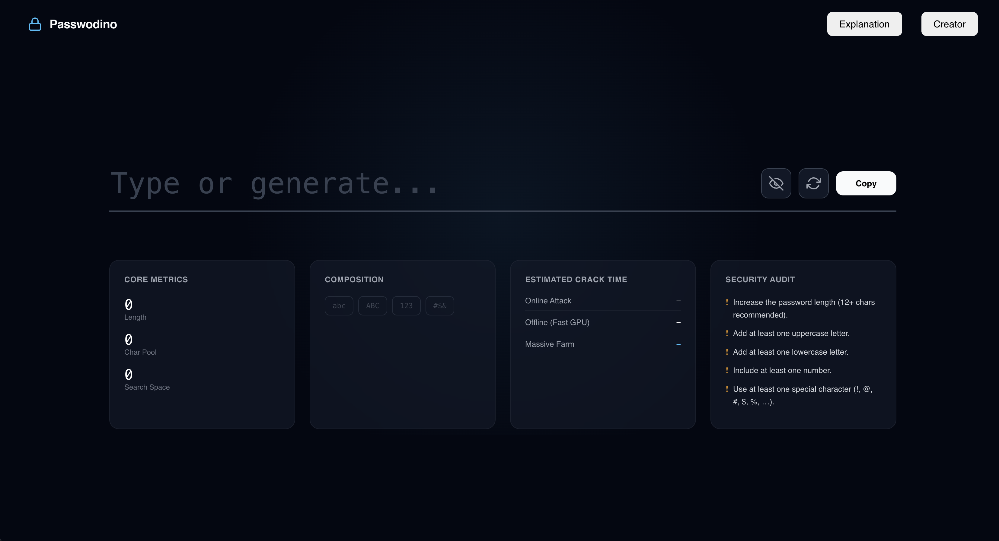

# Passwodino — Password Strength Analyzer

A modern, client-side password strength checker and secure password generator built with Vue 3 and TypeScript. No data is ever sent to a server — all analysis runs entirely in the browser.

**Live Demo:** [passwodino.vercel.app](https://www.passwordino.eu/) 

 

---

## Overview

Passwodino helps users understand how strong their passwords are by analyzing character composition, estimated search space, and theoretical crack time. It also generates cryptographically secure random passwords directly in the browser.

---

## Features

- **Real-time strength analysis** — instant feedback as you type
- **Secure password generator** — uses `crypto.getRandomValues()` for cryptographically strong randomness
- **Search space estimation** — calculates the total number of possible combinations based on character pool and length
- **Crack time estimates** — theoretical time to crack under three attack scenarios (online, GPU, massive farm)
- **Security audit** — actionable recommendations to improve weak passwords
- **Character composition breakdown** — visual indicators for lowercase, uppercase, digits, and symbols
- **Copy to clipboard** — one-click copy with success/error feedback
- **Fully client-side** — no backend, no tracking, no data collection

---

## Tech Stack

| Technology | Purpose |
|---|---|
| [Vue 3](https://vuejs.org/) | UI framework (Composition API) |
| [TypeScript](https://www.typescriptlang.org/) | Type safety |
| [Vite](https://vitejs.dev/) | Build tool and dev server |

---

## Getting Started

### Prerequisites

- Node.js 18+
- npm

### Installation

```bash
# Clone the repository
git clone https://github.com/KyryloStyle/passwodino.git
cd passwodino/passwordino

# Install dependencies
npm install
```

### Running Locally

```bash
npm run dev
```

Open [http://localhost:5173](http://localhost:5173) in your browser.

### Building for Production

```bash
npm run build
```

The output will be in the `dist/` folder, ready to deploy to any static host (Vercel, Netlify, GitHub Pages, etc.).

---

## Project Structure

```
src/
├── components/
│   ├── PasswordChecker.vue   # Main UI — input, strength bar, metrics dashboard
│   ├── SecurityGuide.vue     # Educational section explaining the metrics
│   └── CreatorProfile.vue    # Author profile and contact links
├── utils/
│   └── passwordUtils.ts      # Core logic — scoring, analysis, generation
├── App.vue                   # Root component
└── style.css                 # Global design tokens and base styles
```

---

## Available Scripts

| Command | Description |
|---|---|
| `npm run dev` | Start the local development server |
| `npm run build` | Type-check and build for production |
| `npm run preview` | Preview the production build locally |
| `npm run type-check` | Run TypeScript type checking without building |

---

## Roadmap

- [ ] Entropy display in bits (Shannon entropy)
- [ ] Pwned Passwords API integration (check if password appeared in data breaches)
- [ ] Password history / comparison mode
- [ ] Dark/light theme toggle
- [ ] PWA support for offline use

---

## Author

**Kyrylo Yurchenko** — Software Engineer, based in Germany

- [GitHub](https://github.com/KyryloStyle)
- [LinkedIn](https://www.linkedin.com/in/kyrylo-yurchenko/)
- [Email](mailto:kyrylo.yurchenkoo@gmail.com)

---

## License

This project is open source and available under the [MIT License](LICENSE).
